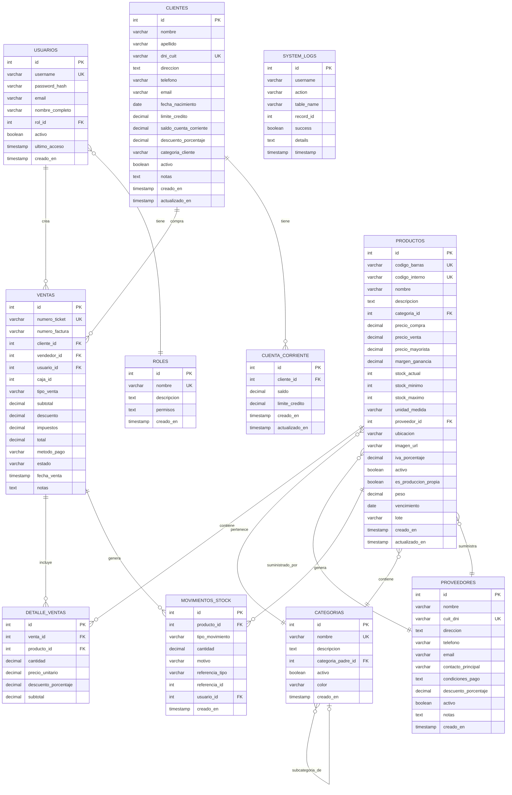

# DIAGRAMA DE BASE DE DATOS - ALMACÉN PRO v2.0

## 🏗️ ESQUEMA OPTIMIZADO DE BASE DE DATOS


```mermaid
erDiagram
    USUARIOS ||--o{ VENTAS : crea
    USUARIOS }o--|| ROLES : tiene
    
    CLIENTES ||--o{ VENTAS : compra
    CLIENTES ||--o{ CUENTA_CORRIENTE : tiene
    
    PRODUCTOS ||--o{ DETALLE_VENTAS : contiene
    PRODUCTOS }o--|| CATEGORIAS : pertenece
    PRODUCTOS }o--|| PROVEEDORES : suministrado_por
    PRODUCTOS ||--o{ MOVIMIENTOS_STOCK : genera
    
    VENTAS ||--o{ DETALLE_VENTAS : incluye
    VENTAS ||--o{ MOVIMIENTOS_STOCK : genera
    
    CATEGORIAS ||--o{ PRODUCTOS : contiene
    CATEGORIAS }o--o| CATEGORIAS : subcategoria_de
    
    PROVEEDORES ||--o{ PRODUCTOS : suministra
    
    USUARIOS {
        int id PK
        varchar username UK
        varchar password_hash
        varchar email
        varchar nombre_completo
        int rol_id FK
        boolean activo
        timestamp ultimo_acceso
        timestamp creado_en
    }
    
    ROLES {
        int id PK
        varchar nombre UK
        text descripcion
        text permisos
        timestamp creado_en
    }
    
    CLIENTES {
        int id PK
        varchar nombre
        varchar apellido
        varchar dni_cuit UK
        text direccion
        varchar telefono
        varchar email
        date fecha_nacimiento
        decimal limite_credito
        decimal saldo_cuenta_corriente
        decimal descuento_porcentaje
        varchar categoria_cliente
        boolean activo
        text notas
        timestamp creado_en
        timestamp actualizado_en
    }
    
    PRODUCTOS {
        int id PK
        varchar codigo_barras UK
        varchar codigo_interno UK
        varchar nombre
        text descripcion
        int categoria_id FK
        decimal precio_compra
        decimal precio_venta
        decimal precio_mayorista
        decimal margen_ganancia
        int stock_actual
        int stock_minimo
        int stock_maximo
        varchar unidad_medida
        int proveedor_id FK
        varchar ubicacion
        varchar imagen_url
        decimal iva_porcentaje
        boolean activo
        boolean es_produccion_propia
        decimal peso
        date vencimiento
        varchar lote
        timestamp creado_en
        timestamp actualizado_en
    }
    
    CATEGORIAS {
        int id PK
        varchar nombre UK
        text descripcion
        int categoria_padre_id FK
        boolean activo
        varchar color
        timestamp creado_en
    }
    
    PROVEEDORES {
        int id PK
        varchar nombre
        varchar cuit_dni UK
        text direccion
        varchar telefono
        varchar email
        varchar contacto_principal
        text condiciones_pago
        decimal descuento_porcentaje
        boolean activo
        text notas
        timestamp creado_en
    }
    
    VENTAS {
        int id PK
        varchar numero_ticket UK
        varchar numero_factura
        int cliente_id FK
        int vendedor_id FK
        int usuario_id FK
        int caja_id
        varchar tipo_venta
        decimal subtotal
        decimal descuento
        decimal impuestos
        decimal total
        varchar metodo_pago
        varchar estado
        timestamp fecha_venta
        text notas
    }
    
    DETALLE_VENTAS {
        int id PK
        int venta_id FK
        int producto_id FK
        decimal cantidad
        decimal precio_unitario
        decimal descuento_porcentaje
        decimal subtotal
    }
    
    MOVIMIENTOS_STOCK {
        int id PK
        int producto_id FK
        varchar tipo_movimiento
        decimal cantidad
        varchar motivo
        varchar referencia_tipo
        int referencia_id
        int usuario_id FK
        timestamp creado_en
    }
    
    CUENTA_CORRIENTE {
        int id PK
        int cliente_id FK
        decimal saldo
        decimal limite_credito
        timestamp creado_en
        timestamp actualizado_en
    }
    
    SYSTEM_LOGS {
        int id PK
        varchar username
        varchar action
        varchar table_name
        int record_id
        boolean success
        text details
        timestamp timestamp
    }
```

## üìä TABLAS PRINCIPALES Y RELACIONES

### 1. **USUARIOS & ROLES**
- **Relación:** Muchos a Uno (usuarios → roles)
- **Propósito:** Control de acceso y permisos
- **Campos clave:** username (√∫nico), rol_id, activo

### 2. **PRODUCTOS & CATEGORÍAS**
- **Relación:** Muchos a Uno (productos → categorías)
- **Propósito:** Organización del catálogo
- **Campos clave:** codigo_barras, codigo_interno, stock_actual

### 3. **PRODUCTOS & PROVEEDORES**
- **Relación:** Muchos a Uno (productos → proveedores)
- **Propósito:** Gestión de suministros
- **Campos clave:** proveedor_id, condiciones_pago

### 4. **VENTAS & CLIENTES**
- **Relación:** Muchos a Uno (ventas → clientes)
- **Propósito:** Historial de compras
- **Campos clave:** cliente_id, fecha_venta, estado

### 5. **VENTAS & DETALLE_VENTAS**
- **Relación:** Uno a Muchos (ventas → detalle_ventas)
- **Propósito:** Items de cada venta
- **Campos clave:** venta_id, producto_id, cantidad

### 6. **MOVIMIENTOS_STOCK**
- **Relación:** Referencias múltiples (productos, usuarios, ventas)
- **Propósito:** Trazabilidad del inventario
- **Campos clave:** producto_id, tipo_movimiento, referencia_id

## üîß CORRECCIONES IDENTIFICADAS

### **Problemas encontrados en las pruebas:**

1. **‚ùå Columna `creado_en` faltante en `detalle_ventas`**
   - **Impacto:** Error al registrar timestamp de detalles
   - **Solución:** Agregar columna `creado_en TIMESTAMP DEFAULT CURRENT_TIMESTAMP`

2. **‚ùå Nombres de columnas inconsistentes**
   - **Problema:** `codigo` vs `codigo_interno`, `stock` vs `stock_actual`
   - **Solución:** Unificar nombres en managers y GUI

3. **‚ùå Tabla `customers` vs `clientes`**
   - **Problema:** Managers esperan tabla `customers` pero existe `clientes`
   - **Solución:** Actualizar managers para usar `clientes`

4. **‚ùå Campo `fecha` vs `fecha_venta`**
   - **Problema:** Reportes buscan `fecha` pero existe `fecha_venta`
   - **Solución:** Actualizar queries para usar `fecha_venta`

## 🎯 ESTRUCTURA FINAL OPTIMIZADA

### **Índices recomendados:**
```sql
-- Índices de rendimiento
CREATE INDEX idx_productos_codigo ON productos(codigo_interno);
CREATE INDEX idx_productos_barcode ON productos(codigo_barras);
CREATE INDEX idx_ventas_fecha ON ventas(fecha_venta);
CREATE INDEX idx_ventas_cliente ON ventas(cliente_id);
CREATE INDEX idx_detalle_venta ON detalle_ventas(venta_id);
CREATE INDEX idx_detalle_producto ON detalle_ventas(producto_id);
CREATE INDEX idx_stock_producto ON movimientos_stock(producto_id);
CREATE INDEX idx_usuarios_username ON usuarios(username);
CREATE INDEX idx_clientes_dni ON clientes(dni_cuit);
```

### **Constraints recomendados:**
```sql
-- Claves for√°neas
ALTER TABLE usuarios ADD CONSTRAINT fk_usuario_rol 
    FOREIGN KEY (rol_id) REFERENCES roles(id);
    
ALTER TABLE productos ADD CONSTRAINT fk_producto_categoria 
    FOREIGN KEY (categoria_id) REFERENCES categorias(id);
    
ALTER TABLE productos ADD CONSTRAINT fk_producto_proveedor 
    FOREIGN KEY (proveedor_id) REFERENCES proveedores(id);
    
ALTER TABLE ventas ADD CONSTRAINT fk_venta_cliente 
    FOREIGN KEY (cliente_id) REFERENCES clientes(id);
    
ALTER TABLE ventas ADD CONSTRAINT fk_venta_vendedor 
    FOREIGN KEY (vendedor_id) REFERENCES usuarios(id);
    
ALTER TABLE detalle_ventas ADD CONSTRAINT fk_detalle_venta 
    FOREIGN KEY (venta_id) REFERENCES ventas(id);
    
ALTER TABLE detalle_ventas ADD CONSTRAINT fk_detalle_producto 
    FOREIGN KEY (producto_id) REFERENCES productos(id);
```

### **Triggers recomendados:**
```sql
-- Actualizar stock autom√°ticamente
CREATE TRIGGER tr_actualizar_stock_venta
    AFTER INSERT ON detalle_ventas
    BEGIN
        UPDATE productos 
        SET stock_actual = stock_actual - NEW.cantidad,
            actualizado_en = CURRENT_TIMESTAMP
        WHERE id = NEW.producto_id;
        
        INSERT INTO movimientos_stock 
        (producto_id, tipo_movimiento, cantidad, motivo, referencia_tipo, referencia_id, creado_en)
        VALUES 
        (NEW.producto_id, 'SALIDA', NEW.cantidad, 'VENTA', 'VENTA', 
         (SELECT id FROM ventas WHERE id = NEW.venta_id), CURRENT_TIMESTAMP);
    END;
```

## üìà BENEFICIOS DE LA ESTRUCTURA OPTIMIZADA

‚úÖ **Integridad referencial completa**  
‚úÖ **Trazabilidad total de movimientos**  
✅ **Rendimiento optimizado con índices**  
‚úÖ **Escalabilidad para crecimiento**  
‚úÖ **Consistencia en nombres de campos**  
✅ **Auditoría completa de operaciones**  
‚úÖ **Soporte para m√∫ltiples tipos de venta**  
✅ **Gestión avanzada de inventario**

---

**Este esquema est√° optimizado para el funcionamiento completo de la GUI con datos reales de la base de datos.**