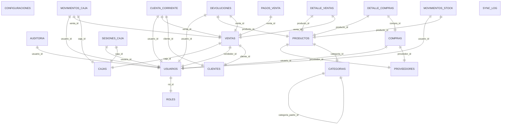
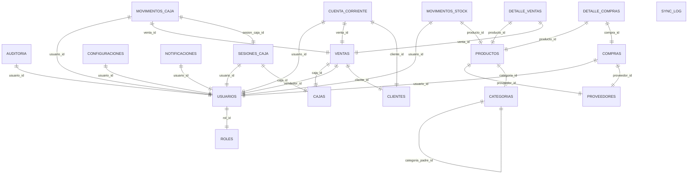

# 🗄️ Análisis Completo de Bases de Datos - AlmacénPro
**Generado:** 2025-08-06 12:43:01

---

## 📊 Resumen Ejecutivo


**Bases de datos encontradas:** 2  
**Total de tablas:** 39  
**Total de registros:** 227  
**Tamaño total:** 0.50 MB  


---

## 🗂️ Base de Datos #1: `almacen_pro.db`

**📍 Ruta:** `almacen_pro.db`  
**📏 Tamaño:** 0.25 MB  
**📋 Tablas:** 20  
**📊 Registros totales:** 125  

### 📋 Resumen de Tablas

| Tabla | Registros | Columnas | Foreign Keys | Índices |
|-------|-----------|----------|--------------|---------|
| `auditoria` | 0 | 10 | 1 | 3 |
| `cajas` | 1 | 5 | 0 | 0 |
| `categorias` | 61 | 5 | 1 | 0 |
| `clientes` | 8 | 15 | 0 | 2 |
| `compras` | 0 | 12 | 2 | 3 |
| `configuraciones` | 8 | 6 | 0 | 1 |
| `cuenta_corriente` | 0 | 11 | 3 | 2 |
| `detalle_compras` | 0 | 6 | 2 | 0 |
| `detalle_ventas` | 0 | 7 | 2 | 2 |
| `devoluciones` | 0 | 8 | 3 | 0 |
| `movimientos_caja` | 0 | 10 | 3 | 0 |
| `movimientos_stock` | 0 | 13 | 2 | 5 |
| `pagos_venta` | 0 | 7 | 1 | 0 |
| `productos` | 13 | 25 | 2 | 7 |
| `proveedores` | 10 | 12 | 0 | 0 |
| `roles` | 7 | 5 | 0 | 1 |
| `sesiones_caja` | 0 | 12 | 2 | 0 |
| `sync_log` | 0 | 7 | 0 | 1 |
| `usuarios` | 5 | 9 | 1 | 4 |
| `ventas` | 12 | 15 | 3 | 5 |

### 🔍 Detalle de Tablas


#### 📊 Tabla: `auditoria`

**Registros:** 0

**Columnas:**
- `id` - INTEGER 🔑
- `tabla` - VARCHAR(50) ⚠️
- `operacion` - VARCHAR(20) ⚠️
- `registro_id` - INTEGER
- `datos_anteriores` - TEXT
- `datos_nuevos` - TEXT
- `usuario_id` - INTEGER
- `fecha_operacion` - TIMESTAMP (default: CURRENT_TIMESTAMP)
- `ip_address` - VARCHAR(45)
- `user_agent` - TEXT

**Relaciones (Foreign Keys):**
- `usuario_id` → `usuarios.id`

**Índices:**
- `idx_auditoria_usuario`: usuario_id
- `idx_auditoria_fecha`: fecha_operacion
- `idx_auditoria_tabla`: tabla

---

#### 📊 Tabla: `cajas`

**Registros:** 1

**Columnas:**
- `id` - INTEGER 🔑
- `nombre` - VARCHAR(100) ⚠️
- `descripcion` - TEXT
- `activo` - BOOLEAN (default: 1)
- `ubicacion` - VARCHAR(100)

**Datos de muestra:**
```json
# Registro 1
{'id': 1, 'nombre': 'Caja Principal', 'descripcion': 'Caja principal del local', 'activo': 1, 'ubicacion': None}

```

---

#### 📊 Tabla: `categorias`

**Registros:** 61

**Columnas:**
- `id` - INTEGER 🔑
- `nombre` - VARCHAR(100) ⚠️
- `descripcion` - TEXT
- `categoria_padre_id` - INTEGER
- `activo` - BOOLEAN (default: 1)

**Relaciones (Foreign Keys):**
- `categoria_padre_id` → `categorias.id`

**Datos de muestra:**
```json
# Registro 1
{'id': 1, 'nombre': 'GENERAL', 'descripcion': 'Productos generales', 'categoria_padre_id': None, 'activo': 1}

# Registro 2
{'id': 2, 'nombre': 'ALIMENTACION', 'descripcion': 'Alimentos y bebidas', 'categoria_padre_id': None, 'activo': 1}

```

---

#### 📊 Tabla: `clientes`

**Registros:** 8

**Columnas:**
- `id` - INTEGER 🔑
- `nombre` - VARCHAR(200) ⚠️
- `apellido` - VARCHAR(200)
- `dni_cuit` - VARCHAR(20)
- `direccion` - TEXT
- `telefono` - VARCHAR(50)
- `email` - VARCHAR(100)
- `fecha_nacimiento` - DATE
- `limite_credito` - DECIMAL(10,2) (default: 0)
- `saldo_cuenta_corriente` - DECIMAL(10,2) (default: 0)
- `descuento_porcentaje` - DECIMAL(5,2) (default: 0)
- `categoria_cliente` - VARCHAR(50) (default: 'MINORISTA')
- `activo` - BOOLEAN (default: 1)
- `notas` - TEXT
- `creado_en` - TIMESTAMP (default: CURRENT_TIMESTAMP)

**Índices:**
- `idx_clientes_activo`: activo
- `idx_clientes_nombre`: nombre, apellido

**Datos de muestra:**
```json
# Registro 1
{'id': 1, 'nombre': 'Juan', 'apellido': 'Pérez', 'dni_cuit': None, 'direccion': 'Av. San Martín 123', 'telefono': '11-1234-5678', 'email': 'juan.perez@email.com', 'fecha_nacimiento': None, 'limite_credito': 0, 'saldo_cuenta_corriente': 0, 'descuento_porcentaje': 0, 'categoria_cliente': 'MINORISTA', 'activo': 1, 'notas': None, 'creado_en': '2025-08-06 15:34:48'}

# Registro 2
{'id': 2, 'nombre': 'María', 'apellido': 'González', 'dni_cuit': None, 'direccion': 'Calle Belgrano 456', 'telefono': '11-2345-6789', 'email': 'maria.gonzalez@email.com', 'fecha_nacimiento': None, 'limite_credito': 0, 'saldo_cuenta_corriente': 0, 'descuento_porcentaje': 0, 'categoria_cliente': 'MINORISTA', 'activo': 1, 'notas': None, 'creado_en': '2025-08-06 15:34:48'}

```

---

#### 📊 Tabla: `compras`

**Registros:** 0

**Columnas:**
- `id` - INTEGER 🔑
- `numero_factura` - VARCHAR(50)
- `proveedor_id` - INTEGER ⚠️
- `usuario_id` - INTEGER ⚠️
- `subtotal` - DECIMAL(10,2) ⚠️
- `descuento` - DECIMAL(10,2) (default: 0)
- `impuestos` - DECIMAL(10,2) (default: 0)
- `total` - DECIMAL(10,2) ⚠️
- `fecha_compra` - TIMESTAMP (default: CURRENT_TIMESTAMP)
- `fecha_vencimiento` - DATE
- `estado` - VARCHAR(20) (default: 'PENDIENTE')
- `notas` - TEXT

**Relaciones (Foreign Keys):**
- `usuario_id` → `usuarios.id`
- `proveedor_id` → `proveedores.id`

**Índices:**
- `idx_compras_estado`: estado
- `idx_compras_proveedor`: proveedor_id
- `idx_compras_fecha`: fecha_compra

---

#### 📊 Tabla: `configuraciones`

**Registros:** 8

**Columnas:**
- `id` - INTEGER 🔑
- `clave` - VARCHAR(100) ⚠️
- `valor` - TEXT
- `descripcion` - TEXT
- `tipo` - VARCHAR(20) (default: 'STRING')
- `actualizado_en` - TIMESTAMP (default: CURRENT_TIMESTAMP)

**Índices:**
- `sqlite_autoindex_configuraciones_1`: clave (UNIQUE)

**Datos de muestra:**
```json
# Registro 1
{'id': 1, 'clave': 'empresa_nombre', 'valor': 'Mi Almacén', 'descripcion': 'Nombre de la empresa', 'tipo': 'STRING', 'actualizado_en': '2025-07-30 20:20:31'}

# Registro 2
{'id': 2, 'clave': 'empresa_direccion', 'valor': '', 'descripcion': 'Dirección de la empresa', 'tipo': 'STRING', 'actualizado_en': '2025-07-30 20:20:31'}

```

---

#### 📊 Tabla: `cuenta_corriente`

**Registros:** 0

**Columnas:**
- `id` - INTEGER 🔑
- `cliente_id` - INTEGER ⚠️
- `tipo_movimiento` - VARCHAR(20) ⚠️
- `concepto` - VARCHAR(100)
- `importe` - DECIMAL(10,2) ⚠️
- `saldo_anterior` - DECIMAL(10,2)
- `saldo_nuevo` - DECIMAL(10,2)
- `venta_id` - INTEGER
- `fecha_movimiento` - TIMESTAMP (default: CURRENT_TIMESTAMP)
- `usuario_id` - INTEGER
- `notas` - TEXT

**Relaciones (Foreign Keys):**
- `usuario_id` → `usuarios.id`
- `venta_id` → `ventas.id`
- `cliente_id` → `clientes.id`

**Índices:**
- `idx_cuenta_corriente_fecha`: fecha_movimiento
- `idx_cuenta_corriente_cliente`: cliente_id

---

#### 📊 Tabla: `detalle_compras`

**Registros:** 0

**Columnas:**
- `id` - INTEGER 🔑
- `compra_id` - INTEGER ⚠️
- `producto_id` - INTEGER ⚠️
- `cantidad` - DECIMAL(8,3) ⚠️
- `precio_unitario` - DECIMAL(10,2) ⚠️
- `subtotal` - DECIMAL(10,2) ⚠️

**Relaciones (Foreign Keys):**
- `producto_id` → `productos.id`
- `compra_id` → `compras.id`

---

#### 📊 Tabla: `detalle_ventas`

**Registros:** 0

**Columnas:**
- `id` - INTEGER 🔑
- `venta_id` - INTEGER ⚠️
- `producto_id` - INTEGER ⚠️
- `cantidad` - DECIMAL(8,3) ⚠️
- `precio_unitario` - DECIMAL(10,2) ⚠️
- `descuento_porcentaje` - DECIMAL(5,2) (default: 0)
- `subtotal` - DECIMAL(10,2) ⚠️

**Relaciones (Foreign Keys):**
- `producto_id` → `productos.id`
- `venta_id` → `ventas.id`

**Índices:**
- `idx_detalle_ventas_producto`: producto_id
- `idx_detalle_ventas_venta`: venta_id

---

#### 📊 Tabla: `devoluciones`

**Registros:** 0

**Columnas:**
- `id` - INTEGER 🔑
- `venta_id` - INTEGER ⚠️
- `producto_id` - INTEGER ⚠️
- `cantidad_devuelta` - DECIMAL(8,3) ⚠️
- `precio_unitario` - DECIMAL(10,2) ⚠️
- `motivo` - TEXT
- `usuario_id` - INTEGER ⚠️
- `fecha_devolucion` - TIMESTAMP (default: CURRENT_TIMESTAMP)

**Relaciones (Foreign Keys):**
- `usuario_id` → `usuarios.id`
- `producto_id` → `productos.id`
- `venta_id` → `ventas.id`

---

#### 📊 Tabla: `movimientos_caja`

**Registros:** 0

**Columnas:**
- `id` - INTEGER 🔑
- `caja_id` - INTEGER ⚠️
- `tipo_movimiento` - VARCHAR(20) ⚠️
- `concepto` - VARCHAR(100)
- `importe` - DECIMAL(10,2) ⚠️
- `saldo_anterior` - DECIMAL(10,2)
- `saldo_nuevo` - DECIMAL(10,2)
- `venta_id` - INTEGER
- `usuario_id` - INTEGER ⚠️
- `fecha_movimiento` - TIMESTAMP (default: CURRENT_TIMESTAMP)

**Relaciones (Foreign Keys):**
- `usuario_id` → `usuarios.id`
- `venta_id` → `ventas.id`
- `caja_id` → `cajas.id`

---

#### 📊 Tabla: `movimientos_stock`

**Registros:** 0

**Columnas:**
- `id` - INTEGER 🔑
- `producto_id` - INTEGER ⚠️
- `tipo_movimiento` - VARCHAR(20) ⚠️
- `motivo` - VARCHAR(50)
- `cantidad_anterior` - DECIMAL(8,3)
- `cantidad_movimiento` - DECIMAL(8,3) ⚠️
- `cantidad_nueva` - DECIMAL(8,3)
- `precio_unitario` - DECIMAL(10,2)
- `usuario_id` - INTEGER
- `referencia_id` - INTEGER
- `referencia_tipo` - VARCHAR(20)
- `fecha_movimiento` - TIMESTAMP (default: CURRENT_TIMESTAMP)
- `notas` - TEXT

**Relaciones (Foreign Keys):**
- `usuario_id` → `usuarios.id`
- `producto_id` → `productos.id`

**Índices:**
- `idx_movimientos_referencia`: referencia_id, referencia_tipo
- `idx_movimientos_tipo`: tipo_movimiento
- `idx_movimientos_fecha`: fecha_movimiento
- `idx_movimientos_producto`: producto_id
- `idx_movimientos_stock_producto`: producto_id

---

#### 📊 Tabla: `pagos_venta`

**Registros:** 0

**Columnas:**
- `id` - INTEGER 🔑
- `venta_id` - INTEGER ⚠️
- `metodo_pago` - VARCHAR(50) ⚠️
- `importe` - DECIMAL(12,2) ⚠️
- `referencia` - VARCHAR(100)
- `fecha_pago` - TIMESTAMP (default: CURRENT_TIMESTAMP)
- `observaciones` - TEXT

**Relaciones (Foreign Keys):**
- `venta_id` → `ventas.id`

---

#### 📊 Tabla: `productos`

**Registros:** 13

**Columnas:**
- `id` - INTEGER 🔑
- `codigo_barras` - VARCHAR(50)
- `codigo_interno` - VARCHAR(50)
- `nombre` - VARCHAR(200) ⚠️
- `descripcion` - TEXT
- `categoria_id` - INTEGER
- `precio_compra` - DECIMAL(10,2)
- `precio_venta` - DECIMAL(10,2)
- `precio_mayorista` - DECIMAL(10,2)
- `margen_ganancia` - DECIMAL(5,2)
- `stock_actual` - INTEGER (default: 0)
- `stock_minimo` - INTEGER (default: 0)
- `stock_maximo` - INTEGER (default: 0)
- `unidad_medida` - VARCHAR(20) (default: 'UNIDAD')
- `proveedor_id` - INTEGER
- `ubicacion` - VARCHAR(100)
- `imagen_url` - VARCHAR(255)
- `iva_porcentaje` - DECIMAL(5,2) (default: 21)
- `activo` - BOOLEAN (default: 1)
- `es_produccion_propia` - BOOLEAN (default: 0)
- `peso` - DECIMAL(8,3)
- `vencimiento` - DATE
- `lote` - VARCHAR(50)
- `creado_en` - TIMESTAMP (default: CURRENT_TIMESTAMP)
- `actualizado_en` - TIMESTAMP (default: CURRENT_TIMESTAMP)

**Relaciones (Foreign Keys):**
- `proveedor_id` → `proveedores.id`
- `categoria_id` → `categorias.id`

**Índices:**
- `idx_productos_activo`: activo
- `idx_productos_proveedor`: proveedor_id
- `idx_productos_categoria`: categoria_id
- `idx_productos_codigo_interno`: codigo_interno
- `idx_productos_nombre`: nombre
- `idx_productos_codigo_barras`: codigo_barras
- `sqlite_autoindex_productos_1`: codigo_barras (UNIQUE)

**Datos de muestra:**
```json
# Registro 1
{'id': 1, 'codigo_barras': '111111111', 'codigo_interno': None, 'nombre': 'AAAAA', 'descripcion': 'AAAAAA', 'categoria_id': 6, 'precio_compra': 1, 'precio_venta': 1.5, 'precio_mayorista': None, 'margen_ganancia': None, 'stock_actual': 10, 'stock_minimo': 2, 'stock_maximo': 0, 'unidad_medida': 'UNIDAD', 'proveedor_id': None, 'ubicacion': None, 'imagen_url': None, 'iva_porcentaje': 21, 'activo': 1, 'es_produccion_propia': 0, 'peso': None, 'vencimiento': None, 'lote': None, 'creado_en': '2025-07-30 21:10:46', 'actualizado_en': '2025-07-30 21:10:46'}

# Registro 2
{'id': 2, 'codigo_barras': '7790150491072', 'codigo_interno': 'P001', 'nombre': 'Leche Entera La Serenísima 1L', 'descripcion': 'Leche entera larga vida 1 litro', 'categoria_id': 52, 'precio_compra': 280.5, 'precio_venta': 350, 'precio_mayorista': None, 'margen_ganancia': 24.78, 'stock_actual': 45, 'stock_minimo': 5, 'stock_maximo': 100, 'unidad_medida': 'UNIDAD', 'proveedor_id': 1, 'ubicacion': None, 'imagen_url': None, 'iva_porcentaje': 21, 'activo': 1, 'es_produccion_propia': 0, 'peso': None, 'vencimiento': None, 'lote': None, 'creado_en': '2025-08-06 15:34:48', 'actualizado_en': '2025-08-06 15:34:48'}

```

---

#### 📊 Tabla: `proveedores`

**Registros:** 10

**Columnas:**
- `id` - INTEGER 🔑
- `nombre` - VARCHAR(200) ⚠️
- `cuit_dni` - VARCHAR(20)
- `direccion` - TEXT
- `telefono` - VARCHAR(50)
- `email` - VARCHAR(100)
- `contacto_principal` - VARCHAR(100)
- `condiciones_pago` - TEXT
- `descuento_porcentaje` - DECIMAL(5,2) (default: 0)
- `activo` - BOOLEAN (default: 1)
- `notas` - TEXT
- `creado_en` - TIMESTAMP (default: CURRENT_TIMESTAMP)

**Datos de muestra:**
```json
# Registro 1
{'id': 1, 'nombre': 'Distribuidora La Serenísima', 'cuit_dni': None, 'direccion': 'Av. Corrientes 1234, CABA', 'telefono': '11-4444-5555', 'email': 'pedidos@laserenisima.com', 'contacto_principal': None, 'condiciones_pago': None, 'descuento_porcentaje': 0, 'activo': 1, 'notas': None, 'creado_en': '2025-08-06 15:34:48'}

# Registro 2
{'id': 2, 'nombre': 'Coca Cola Argentina', 'cuit_dni': None, 'direccion': 'Av. del Libertador 567, CABA', 'telefono': '11-5555-6666', 'email': 'ventas@cocacola.com.ar', 'contacto_principal': None, 'condiciones_pago': None, 'descuento_porcentaje': 0, 'activo': 1, 'notas': None, 'creado_en': '2025-08-06 15:34:48'}

```

---

#### 📊 Tabla: `roles`

**Registros:** 7

**Columnas:**
- `id` - INTEGER 🔑
- `nombre` - VARCHAR(50) ⚠️
- `descripcion` - TEXT
- `permisos` - TEXT
- `creado_en` - TIMESTAMP (default: CURRENT_TIMESTAMP)

**Índices:**
- `sqlite_autoindex_roles_1`: nombre (UNIQUE)

**Datos de muestra:**
```json
# Registro 1
{'id': 1, 'nombre': 'ADMIN', 'descripcion': 'Administrator', 'permisos': '{"all": true}', 'creado_en': '2025-07-30 20:20:31'}

# Registro 2
{'id': 2, 'nombre': 'GERENTE', 'descripcion': 'Gerente', 'permisos': '{"ventas": true, "compras": true, "reportes": t...', 'creado_en': '2025-07-30 20:20:31'}

```

---

#### 📊 Tabla: `sesiones_caja`

**Registros:** 0

**Columnas:**
- `id` - INTEGER 🔑
- `caja_id` - INTEGER ⚠️
- `usuario_id` - INTEGER ⚠️
- `fecha_apertura` - TIMESTAMP (default: CURRENT_TIMESTAMP)
- `fecha_cierre` - TIMESTAMP
- `monto_apertura` - DECIMAL(12,2) (default: 0)
- `monto_cierre` - DECIMAL(12,2) (default: 0)
- `monto_ventas` - DECIMAL(12,2) (default: 0)
- `monto_esperado` - DECIMAL(12,2) (default: 0)
- `diferencia` - DECIMAL(12,2) (default: 0)
- `estado` - VARCHAR(20) (default: 'ABIERTA')
- `observaciones` - TEXT

**Relaciones (Foreign Keys):**
- `usuario_id` → `usuarios.id`
- `caja_id` → `cajas.id`

---

#### 📊 Tabla: `sync_log`

**Registros:** 0

**Columnas:**
- `id` - INTEGER 🔑
- `tabla` - VARCHAR(50)
- `operacion` - VARCHAR(20)
- `registro_id` - INTEGER
- `datos_json` - TEXT
- `sincronizado` - BOOLEAN (default: 0)
- `fecha_operacion` - TIMESTAMP (default: CURRENT_TIMESTAMP)

**Índices:**
- `idx_sync_log_sincronizado`: sincronizado

---

#### 📊 Tabla: `usuarios`

**Registros:** 5

**Columnas:**
- `id` - INTEGER 🔑
- `username` - VARCHAR(50) ⚠️
- `password_hash` - VARCHAR(255) ⚠️
- `email` - VARCHAR(100)
- `nombre_completo` - VARCHAR(100)
- `rol_id` - INTEGER
- `activo` - BOOLEAN (default: 1)
- `ultimo_acceso` - TIMESTAMP
- `creado_en` - TIMESTAMP (default: CURRENT_TIMESTAMP)

**Relaciones (Foreign Keys):**
- `rol_id` → `roles.id`

**Índices:**
- `idx_usuarios_activo`: activo
- `idx_usuarios_email`: email
- `idx_usuarios_username`: username
- `sqlite_autoindex_usuarios_1`: username (UNIQUE)

**Datos de muestra:**
```json
# Registro 1
{'id': 1, 'username': 'admin', 'password_hash': '$2b$12$m7iyUiNyAh/nGesdMPp2x.SheH0WIosBCFpPGxb3...', 'email': None, 'nombre_completo': 'Administrador', 'rol_id': 1, 'activo': 1, 'ultimo_acceso': '2025-08-06 15:36:36', 'creado_en': '2025-07-30 20:20:31'}

# Registro 2
{'id': 8, 'username': 'gerente', 'password_hash': '$2b$12$nTH5TFxrgV4cQB0XsHgAIOYa3hUwd8CDoeEHnJIS...', 'email': 'gerente@almacenpro.com', 'nombre_completo': 'Juan Pérez - Gerente', 'rol_id': 2, 'activo': 1, 'ultimo_acceso': '2025-08-06 15:17:38', 'creado_en': '2025-08-06 14:54:59'}

```

---

#### 📊 Tabla: `ventas`

**Registros:** 12

**Columnas:**
- `id` - INTEGER 🔑
- `numero_ticket` - VARCHAR(50)
- `numero_factura` - VARCHAR(50)
- `cliente_id` - INTEGER
- `vendedor_id` - INTEGER ⚠️
- `caja_id` - INTEGER
- `tipo_venta` - VARCHAR(20) (default: 'CONTADO')
- `subtotal` - DECIMAL(10,2) ⚠️
- `descuento` - DECIMAL(10,2) (default: 0)
- `impuestos` - DECIMAL(10,2) (default: 0)
- `total` - DECIMAL(10,2) ⚠️
- `metodo_pago` - VARCHAR(50)
- `estado` - VARCHAR(20) (default: 'COMPLETADA')
- `fecha_venta` - TIMESTAMP (default: CURRENT_TIMESTAMP)
- `notas` - TEXT

**Relaciones (Foreign Keys):**
- `caja_id` → `cajas.id`
- `vendedor_id` → `usuarios.id`
- `cliente_id` → `clientes.id`

**Índices:**
- `idx_ventas_numero`: numero_factura
- `idx_ventas_estado`: estado
- `idx_ventas_cliente`: cliente_id
- `idx_ventas_fecha`: fecha_venta
- `sqlite_autoindex_ventas_1`: numero_ticket (UNIQUE)

**Datos de muestra:**
```json
# Registro 1
{'id': 1, 'numero_ticket': None, 'numero_factura': 'V0001', 'cliente_id': 7, 'vendedor_id': 11, 'caja_id': None, 'tipo_venta': 'CONTADO', 'subtotal': 2961.35, 'descuento': 0, 'impuestos': 621.88, 'total': 3583.23, 'metodo_pago': 'EFECTIVO', 'estado': 'COMPLETADA', 'fecha_venta': '2025-07-08T12:34:48.679919', 'notas': None}

# Registro 2
{'id': 2, 'numero_ticket': None, 'numero_factura': 'V0002', 'cliente_id': 1, 'vendedor_id': 9, 'caja_id': None, 'tipo_venta': 'CONTADO', 'subtotal': 734.5, 'descuento': 0, 'impuestos': 154.25, 'total': 888.75, 'metodo_pago': 'TARJETA', 'estado': 'COMPLETADA', 'fecha_venta': '2025-07-23T12:34:48.680918', 'notas': None}

```

---

### 🔗 Mapa de Relaciones



**Relaciones detalladas:**
- `auditoria.usuario_id` → `usuarios.id`
- `categorias.categoria_padre_id` → `categorias.id`
- `compras.usuario_id` → `usuarios.id`
- `compras.proveedor_id` → `proveedores.id`
- `cuenta_corriente.usuario_id` → `usuarios.id`
- `cuenta_corriente.venta_id` → `ventas.id`
- `cuenta_corriente.cliente_id` → `clientes.id`
- `detalle_compras.producto_id` → `productos.id`
- `detalle_compras.compra_id` → `compras.id`
- `detalle_ventas.producto_id` → `productos.id`
- `detalle_ventas.venta_id` → `ventas.id`
- `devoluciones.usuario_id` → `usuarios.id`
- `devoluciones.producto_id` → `productos.id`
- `devoluciones.venta_id` → `ventas.id`
- `movimientos_caja.usuario_id` → `usuarios.id`
- `movimientos_caja.venta_id` → `ventas.id`
- `movimientos_caja.caja_id` → `cajas.id`
- `movimientos_stock.usuario_id` → `usuarios.id`
- `movimientos_stock.producto_id` → `productos.id`
- `pagos_venta.venta_id` → `ventas.id`
- `productos.proveedor_id` → `proveedores.id`
- `productos.categoria_id` → `categorias.id`
- `sesiones_caja.usuario_id` → `usuarios.id`
- `sesiones_caja.caja_id` → `cajas.id`
- `usuarios.rol_id` → `roles.id`
- `ventas.caja_id` → `cajas.id`
- `ventas.vendedor_id` → `usuarios.id`
- `ventas.cliente_id` → `clientes.id`

---

## 🗂️ Base de Datos #2: `almacen_pro.db`

**📍 Ruta:** `data\almacen_pro.db`  
**📏 Tamaño:** 0.25 MB  
**📋 Tablas:** 19  
**📊 Registros totales:** 102  

### 📋 Resumen de Tablas

| Tabla | Registros | Columnas | Foreign Keys | Índices |
|-------|-----------|----------|--------------|---------|
| `auditoria` | 0 | 10 | 1 | 3 |
| `cajas` | 1 | 8 | 0 | 0 |
| `categorias` | 66 | 8 | 1 | 0 |
| `clientes` | 0 | 21 | 0 | 0 |
| `compras` | 0 | 16 | 2 | 3 |
| `configuraciones` | 28 | 8 | 1 | 1 |
| `cuenta_corriente` | 0 | 12 | 3 | 2 |
| `detalle_compras` | 0 | 13 | 2 | 0 |
| `detalle_ventas` | 0 | 10 | 2 | 2 |
| `movimientos_caja` | 0 | 12 | 3 | 0 |
| `movimientos_stock` | 0 | 14 | 2 | 3 |
| `notificaciones` | 0 | 12 | 1 | 3 |
| `productos` | 0 | 28 | 2 | 6 |
| `proveedores` | 0 | 21 | 0 | 0 |
| `roles` | 6 | 7 | 0 | 1 |
| `sesiones_caja` | 0 | 12 | 2 | 0 |
| `sync_log` | 0 | 10 | 0 | 2 |
| `usuarios` | 1 | 12 | 1 | 4 |
| `ventas` | 0 | 21 | 3 | 6 |

### 🔍 Detalle de Tablas


#### 📊 Tabla: `auditoria`

**Registros:** 0

**Columnas:**
- `id` - INTEGER 🔑
- `tabla` - VARCHAR(50) ⚠️
- `operacion` - VARCHAR(20) ⚠️
- `registro_id` - INTEGER
- `datos_anteriores` - TEXT
- `datos_nuevos` - TEXT
- `usuario_id` - INTEGER
- `ip_address` - VARCHAR(45)
- `user_agent` - TEXT
- `fecha_operacion` - TIMESTAMP (default: CURRENT_TIMESTAMP)

**Relaciones (Foreign Keys):**
- `usuario_id` → `usuarios.id`

**Índices:**
- `idx_auditoria_fecha`: fecha_operacion
- `idx_auditoria_usuario`: usuario_id
- `idx_auditoria_tabla`: tabla

---

#### 📊 Tabla: `cajas`

**Registros:** 1

**Columnas:**
- `id` - INTEGER 🔑
- `nombre` - VARCHAR(100) ⚠️
- `descripcion` - TEXT
- `ubicacion` - VARCHAR(100)
- `impresora_ticket` - VARCHAR(200)
- `cajón_monedero` - BOOLEAN (default: 0)
- `activo` - BOOLEAN (default: 1)
- `creado_en` - TIMESTAMP (default: CURRENT_TIMESTAMP)

**Datos de muestra:**
```json
# Registro 1
{'id': 1, 'nombre': 'Caja Principal', 'descripcion': 'Caja principal del local', 'ubicacion': None, 'impresora_ticket': None, 'cajón_monedero': 0, 'activo': 1, 'creado_en': '2025-07-30 22:44:15'}

```

---

#### 📊 Tabla: `categorias`

**Registros:** 66

**Columnas:**
- `id` - INTEGER 🔑
- `nombre` - VARCHAR(100) ⚠️
- `descripcion` - TEXT
- `categoria_padre_id` - INTEGER
- `activo` - BOOLEAN (default: 1)
- `orden` - INTEGER (default: 0)
- `creado_en` - TIMESTAMP (default: CURRENT_TIMESTAMP)
- `actualizado_en` - TIMESTAMP (default: CURRENT_TIMESTAMP)

**Relaciones (Foreign Keys):**
- `categoria_padre_id` → `categorias.id`

**Datos de muestra:**
```json
# Registro 1
{'id': 1, 'nombre': 'GENERAL', 'descripcion': 'Productos generales', 'categoria_padre_id': None, 'activo': 1, 'orden': 0, 'creado_en': '2025-07-30 22:44:15', 'actualizado_en': '2025-07-30 22:44:15'}

# Registro 2
{'id': 2, 'nombre': 'ALIMENTACION', 'descripcion': 'Alimentos y bebidas', 'categoria_padre_id': None, 'activo': 1, 'orden': 1, 'creado_en': '2025-07-30 22:44:15', 'actualizado_en': '2025-07-30 22:44:15'}

```

---

#### 📊 Tabla: `clientes`

**Registros:** 0

**Columnas:**
- `id` - INTEGER 🔑
- `nombre` - VARCHAR(200) ⚠️
- `apellido` - VARCHAR(200)
- `dni_cuit` - VARCHAR(20)
- `direccion` - TEXT
- `ciudad` - VARCHAR(100)
- `provincia` - VARCHAR(100)
- `codigo_postal` - VARCHAR(10)
- `telefono` - VARCHAR(50)
- `telefono_alternativo` - VARCHAR(50)
- `email` - VARCHAR(100)
- `fecha_nacimiento` - DATE
- `limite_credito` - DECIMAL(10,2) (default: 0)
- `saldo_cuenta_corriente` - DECIMAL(10,2) (default: 0)
- `descuento_porcentaje` - DECIMAL(5,2) (default: 0)
- `categoria_cliente` - VARCHAR(50) (default: 'MINORISTA')
- `activo` - BOOLEAN (default: 1)
- `es_consumidor_final` - BOOLEAN (default: 1)
- `notas` - TEXT
- `creado_en` - TIMESTAMP (default: CURRENT_TIMESTAMP)
- `actualizado_en` - TIMESTAMP (default: CURRENT_TIMESTAMP)

---

#### 📊 Tabla: `compras`

**Registros:** 0

**Columnas:**
- `id` - INTEGER 🔑
- `numero_factura` - VARCHAR(50)
- `numero_remito` - VARCHAR(50)
- `proveedor_id` - INTEGER ⚠️
- `usuario_id` - INTEGER ⚠️
- `subtotal` - DECIMAL(10,2) ⚠️
- `descuento` - DECIMAL(10,2) (default: 0)
- `recargo` - DECIMAL(10,2) (default: 0)
- `impuestos` - DECIMAL(10,2) (default: 0)
- `total` - DECIMAL(10,2) ⚠️
- `fecha_compra` - TIMESTAMP (default: CURRENT_TIMESTAMP)
- `fecha_factura` - DATE
- `fecha_vencimiento` - DATE
- `estado` - VARCHAR(20) (default: 'PENDIENTE')
- `tipo_comprobante` - VARCHAR(20) (default: 'FACTURA')
- `observaciones` - TEXT

**Relaciones (Foreign Keys):**
- `usuario_id` → `usuarios.id`
- `proveedor_id` → `proveedores.id`

**Índices:**
- `idx_compras_estado`: estado
- `idx_compras_proveedor`: proveedor_id
- `idx_compras_fecha`: fecha_compra

---

#### 📊 Tabla: `configuraciones`

**Registros:** 28

**Columnas:**
- `id` - INTEGER 🔑
- `clave` - VARCHAR(100) ⚠️
- `valor` - TEXT
- `descripcion` - TEXT
- `tipo` - VARCHAR(20) (default: 'STRING')
- `categoria` - VARCHAR(50) (default: 'GENERAL')
- `actualizado_en` - TIMESTAMP (default: CURRENT_TIMESTAMP)
- `usuario_id` - INTEGER

**Relaciones (Foreign Keys):**
- `usuario_id` → `usuarios.id`

**Índices:**
- `sqlite_autoindex_configuraciones_1`: clave (UNIQUE)

**Datos de muestra:**
```json
# Registro 1
{'id': 1, 'clave': 'empresa_nombre', 'valor': 'Mi Almacén', 'descripcion': 'Nombre de la empresa', 'tipo': 'STRING', 'categoria': 'EMPRESA', 'actualizado_en': '2025-07-30 22:44:15', 'usuario_id': None}

# Registro 2
{'id': 2, 'clave': 'empresa_direccion', 'valor': '', 'descripcion': 'Dirección de la empresa', 'tipo': 'STRING', 'categoria': 'EMPRESA', 'actualizado_en': '2025-07-30 22:44:15', 'usuario_id': None}

```

---

#### 📊 Tabla: `cuenta_corriente`

**Registros:** 0

**Columnas:**
- `id` - INTEGER 🔑
- `cliente_id` - INTEGER ⚠️
- `tipo_movimiento` - VARCHAR(20) ⚠️
- `concepto` - VARCHAR(100)
- `importe` - DECIMAL(10,2) ⚠️
- `saldo_anterior` - DECIMAL(10,2)
- `saldo_nuevo` - DECIMAL(10,2)
- `venta_id` - INTEGER
- `fecha_movimiento` - TIMESTAMP (default: CURRENT_TIMESTAMP)
- `fecha_vencimiento` - DATE
- `usuario_id` - INTEGER
- `observaciones` - TEXT

**Relaciones (Foreign Keys):**
- `usuario_id` → `usuarios.id`
- `venta_id` → `ventas.id`
- `cliente_id` → `clientes.id`

**Índices:**
- `idx_cuenta_corriente_fecha`: fecha_movimiento
- `idx_cuenta_corriente_cliente`: cliente_id

---

#### 📊 Tabla: `detalle_compras`

**Registros:** 0

**Columnas:**
- `id` - INTEGER 🔑
- `compra_id` - INTEGER ⚠️
- `producto_id` - INTEGER ⚠️
- `cantidad` - DECIMAL(8,3) ⚠️
- `cantidad_recibida` - DECIMAL(8,3) (default: 0)
- `precio_unitario` - DECIMAL(10,2) ⚠️
- `descuento_porcentaje` - DECIMAL(5,2) (default: 0)
- `descuento_importe` - DECIMAL(10,2) (default: 0)
- `subtotal` - DECIMAL(10,2) ⚠️
- `iva_porcentaje` - DECIMAL(5,2) (default: 21)
- `iva_importe` - DECIMAL(10,2) (default: 0)
- `lote` - VARCHAR(50)
- `fecha_vencimiento` - DATE

**Relaciones (Foreign Keys):**
- `producto_id` → `productos.id`
- `compra_id` → `compras.id`

---

#### 📊 Tabla: `detalle_ventas`

**Registros:** 0

**Columnas:**
- `id` - INTEGER 🔑
- `venta_id` - INTEGER ⚠️
- `producto_id` - INTEGER ⚠️
- `cantidad` - DECIMAL(8,3) ⚠️
- `precio_unitario` - DECIMAL(10,2) ⚠️
- `descuento_porcentaje` - DECIMAL(5,2) (default: 0)
- `descuento_importe` - DECIMAL(10,2) (default: 0)
- `subtotal` - DECIMAL(10,2) ⚠️
- `iva_porcentaje` - DECIMAL(5,2) (default: 21)
- `iva_importe` - DECIMAL(10,2) (default: 0)

**Relaciones (Foreign Keys):**
- `producto_id` → `productos.id`
- `venta_id` → `ventas.id`

**Índices:**
- `idx_detalle_ventas_producto`: producto_id
- `idx_detalle_ventas_venta`: venta_id

---

#### 📊 Tabla: `movimientos_caja`

**Registros:** 0

**Columnas:**
- `id` - INTEGER 🔑
- `sesion_caja_id` - INTEGER ⚠️
- `tipo_movimiento` - VARCHAR(20) ⚠️
- `concepto` - VARCHAR(100)
- `importe` - DECIMAL(10,2) ⚠️
- `saldo_anterior` - DECIMAL(10,2)
- `saldo_nuevo` - DECIMAL(10,2)
- `venta_id` - INTEGER
- `metodo_pago` - VARCHAR(50)
- `fecha_movimiento` - TIMESTAMP (default: CURRENT_TIMESTAMP)
- `usuario_id` - INTEGER ⚠️
- `observaciones` - TEXT

**Relaciones (Foreign Keys):**
- `usuario_id` → `usuarios.id`
- `venta_id` → `ventas.id`
- `sesion_caja_id` → `sesiones_caja.id`

---

#### 📊 Tabla: `movimientos_stock`

**Registros:** 0

**Columnas:**
- `id` - INTEGER 🔑
- `producto_id` - INTEGER ⚠️
- `tipo_movimiento` - VARCHAR(20) ⚠️
- `motivo` - VARCHAR(50)
- `cantidad_anterior` - DECIMAL(8,3)
- `cantidad_movimiento` - DECIMAL(8,3) ⚠️
- `cantidad_nueva` - DECIMAL(8,3)
- `precio_unitario` - DECIMAL(10,2)
- `usuario_id` - INTEGER
- `referencia_id` - INTEGER
- `referencia_tipo` - VARCHAR(20)
- `fecha_movimiento` - TIMESTAMP (default: CURRENT_TIMESTAMP)
- `observaciones` - TEXT
- `lote` - VARCHAR(50)

**Relaciones (Foreign Keys):**
- `usuario_id` → `usuarios.id`
- `producto_id` → `productos.id`

**Índices:**
- `idx_movimientos_stock_tipo`: tipo_movimiento
- `idx_movimientos_stock_fecha`: fecha_movimiento
- `idx_movimientos_stock_producto`: producto_id

---

#### 📊 Tabla: `notificaciones`

**Registros:** 0

**Columnas:**
- `id` - INTEGER 🔑
- `tipo` - VARCHAR(50) ⚠️
- `titulo` - VARCHAR(200) ⚠️
- `mensaje` - TEXT
- `usuario_id` - INTEGER
- `leida` - BOOLEAN (default: 0)
- `fecha_creacion` - TIMESTAMP (default: CURRENT_TIMESTAMP)
- `fecha_lectura` - TIMESTAMP
- `fecha_expiracion` - TIMESTAMP
- `prioridad` - VARCHAR(20) (default: 'NORMAL')
- `categoria` - VARCHAR(50) (default: 'SISTEMA')
- `datos_extra` - TEXT

**Relaciones (Foreign Keys):**
- `usuario_id` → `usuarios.id`

**Índices:**
- `idx_notificaciones_fecha`: fecha_creacion
- `idx_notificaciones_leida`: leida
- `idx_notificaciones_usuario`: usuario_id

---

#### 📊 Tabla: `productos`

**Registros:** 0

**Columnas:**
- `id` - INTEGER 🔑
- `codigo_barras` - VARCHAR(50)
- `codigo_interno` - VARCHAR(50)
- `nombre` - VARCHAR(200) ⚠️
- `descripcion` - TEXT
- `categoria_id` - INTEGER
- `precio_compra` - DECIMAL(10,2)
- `precio_venta` - DECIMAL(10,2)
- `precio_mayorista` - DECIMAL(10,2)
- `margen_ganancia` - DECIMAL(5,2)
- `stock_actual` - INTEGER (default: 0)
- `stock_minimo` - INTEGER (default: 0)
- `stock_maximo` - INTEGER (default: 0)
- `unidad_medida` - VARCHAR(20) (default: 'UNIDAD')
- `proveedor_id` - INTEGER
- `ubicacion` - VARCHAR(100)
- `imagen_url` - VARCHAR(255)
- `iva_porcentaje` - DECIMAL(5,2) (default: 21)
- `activo` - BOOLEAN (default: 1)
- `es_produccion_propia` - BOOLEAN (default: 0)
- `peso` - DECIMAL(8,3)
- `vencimiento` - DATE
- `lote` - VARCHAR(50)
- `permite_venta_sin_stock` - BOOLEAN (default: 0)
- `es_pesable` - BOOLEAN (default: 0)
- `codigo_plu` - VARCHAR(10)
- `creado_en` - TIMESTAMP (default: CURRENT_TIMESTAMP)
- `actualizado_en` - TIMESTAMP (default: CURRENT_TIMESTAMP)

**Relaciones (Foreign Keys):**
- `proveedor_id` → `proveedores.id`
- `categoria_id` → `categorias.id`

**Índices:**
- `idx_productos_stock`: stock_actual
- `idx_productos_activo`: activo
- `idx_productos_categoria`: categoria_id
- `idx_productos_nombre`: nombre
- `idx_productos_codigo_barras`: codigo_barras
- `sqlite_autoindex_productos_1`: codigo_barras (UNIQUE)

---

#### 📊 Tabla: `proveedores`

**Registros:** 0

**Columnas:**
- `id` - INTEGER 🔑
- `nombre` - VARCHAR(200) ⚠️
- `cuit_dni` - VARCHAR(20)
- `direccion` - TEXT
- `ciudad` - VARCHAR(100)
- `provincia` - VARCHAR(100)
- `codigo_postal` - VARCHAR(10)
- `telefono` - VARCHAR(50)
- `telefono_alternativo` - VARCHAR(50)
- `email` - VARCHAR(100)
- `sitio_web` - VARCHAR(200)
- `contacto_principal` - VARCHAR(100)
- `cargo_contacto` - VARCHAR(100)
- `condiciones_pago` - TEXT
- `descuento_porcentaje` - DECIMAL(5,2) (default: 0)
- `limite_credito` - DECIMAL(10,2) (default: 0)
- `activo` - BOOLEAN (default: 1)
- `calificacion` - INTEGER (default: 5)
- `notas` - TEXT
- `creado_en` - TIMESTAMP (default: CURRENT_TIMESTAMP)
- `actualizado_en` - TIMESTAMP (default: CURRENT_TIMESTAMP)

---

#### 📊 Tabla: `roles`

**Registros:** 6

**Columnas:**
- `id` - INTEGER 🔑
- `nombre` - VARCHAR(50) ⚠️
- `descripcion` - TEXT
- `permisos` - TEXT
- `activo` - BOOLEAN (default: 1)
- `creado_en` - TIMESTAMP (default: CURRENT_TIMESTAMP)
- `actualizado_en` - TIMESTAMP (default: CURRENT_TIMESTAMP)

**Índices:**
- `sqlite_autoindex_roles_1`: nombre (UNIQUE)

**Datos de muestra:**
```json
# Registro 1
{'id': 1, 'nombre': 'ADMIN', 'descripcion': 'Administrador', 'permisos': '{"all": true}', 'activo': 1, 'creado_en': '2025-07-30 22:44:15', 'actualizado_en': '2025-07-30 22:44:15'}

# Registro 2
{'id': 2, 'nombre': 'GERENTE', 'descripcion': 'Gerente', 'permisos': '{"ventas": true, "compras": true, "reportes": t...', 'activo': 1, 'creado_en': '2025-07-30 22:44:15', 'actualizado_en': '2025-07-30 22:44:15'}

```

---

#### 📊 Tabla: `sesiones_caja`

**Registros:** 0

**Columnas:**
- `id` - INTEGER 🔑
- `caja_id` - INTEGER ⚠️
- `usuario_id` - INTEGER ⚠️
- `fecha_apertura` - TIMESTAMP (default: CURRENT_TIMESTAMP)
- `fecha_cierre` - TIMESTAMP
- `monto_apertura` - DECIMAL(10,2) (default: 0)
- `monto_cierre` - DECIMAL(10,2) (default: 0)
- `monto_ventas` - DECIMAL(10,2) (default: 0)
- `monto_esperado` - DECIMAL(10,2) (default: 0)
- `diferencia` - DECIMAL(10,2) (default: 0)
- `estado` - VARCHAR(20) (default: 'ABIERTA')
- `observaciones` - TEXT

**Relaciones (Foreign Keys):**
- `usuario_id` → `usuarios.id`
- `caja_id` → `cajas.id`

---

#### 📊 Tabla: `sync_log`

**Registros:** 0

**Columnas:**
- `id` - INTEGER 🔑
- `tabla` - VARCHAR(50)
- `operacion` - VARCHAR(20)
- `registro_id` - INTEGER
- `datos_json` - TEXT
- `sincronizado` - BOOLEAN (default: 0)
- `fecha_operacion` - TIMESTAMP (default: CURRENT_TIMESTAMP)
- `fecha_sincronizacion` - TIMESTAMP
- `servidor_destino` - VARCHAR(100)
- `error_mensaje` - TEXT

**Índices:**
- `idx_sync_log_fecha`: fecha_operacion
- `idx_sync_log_sincronizado`: sincronizado

---

#### 📊 Tabla: `usuarios`

**Registros:** 1

**Columnas:**
- `id` - INTEGER 🔑
- `username` - VARCHAR(50) ⚠️
- `password_hash` - VARCHAR(255) ⚠️
- `email` - VARCHAR(100)
- `nombre_completo` - VARCHAR(100)
- `rol_id` - INTEGER
- `activo` - BOOLEAN (default: 1)
- `ultimo_acceso` - TIMESTAMP
- `intentos_login` - INTEGER (default: 0)
- `bloqueado_hasta` - TIMESTAMP
- `creado_en` - TIMESTAMP (default: CURRENT_TIMESTAMP)
- `actualizado_en` - TIMESTAMP (default: CURRENT_TIMESTAMP)

**Relaciones (Foreign Keys):**
- `rol_id` → `roles.id`

**Índices:**
- `idx_usuarios_ultimo_acceso`: ultimo_acceso
- `idx_usuarios_activo`: activo
- `idx_usuarios_username`: username
- `sqlite_autoindex_usuarios_1`: username (UNIQUE)

**Datos de muestra:**
```json
# Registro 1
{'id': 1, 'username': 'admin', 'password_hash': '240be518fabd2724ddb6f04eeb1da5967448d7e831c08c8...', 'email': None, 'nombre_completo': 'Administrador del Sistema', 'rol_id': 1, 'activo': 1, 'ultimo_acceso': None, 'intentos_login': 0, 'bloqueado_hasta': None, 'creado_en': '2025-07-30 22:44:15', 'actualizado_en': '2025-07-30 22:44:15'}

```

---

#### 📊 Tabla: `ventas`

**Registros:** 0

**Columnas:**
- `id` - INTEGER 🔑
- `numero_ticket` - VARCHAR(50)
- `numero_factura` - VARCHAR(50)
- `cliente_id` - INTEGER
- `vendedor_id` - INTEGER ⚠️
- `caja_id` - INTEGER
- `tipo_venta` - VARCHAR(20) (default: 'CONTADO')
- `tipo_comprobante` - VARCHAR(20) (default: 'TICKET')
- `subtotal` - DECIMAL(10,2) ⚠️
- `descuento` - DECIMAL(10,2) (default: 0)
- `recargo` - DECIMAL(10,2) (default: 0)
- `impuestos` - DECIMAL(10,2) (default: 0)
- `total` - DECIMAL(10,2) ⚠️
- `metodo_pago` - VARCHAR(50)
- `estado` - VARCHAR(20) (default: 'COMPLETADA')
- `fecha_venta` - TIMESTAMP (default: CURRENT_TIMESTAMP)
- `fecha_vencimiento` - DATE
- `observaciones` - TEXT
- `cae` - VARCHAR(20)
- `fecha_vto_cae` - DATE
- `punto_venta` - INTEGER (default: 1)

**Relaciones (Foreign Keys):**
- `caja_id` → `cajas.id`
- `vendedor_id` → `usuarios.id`
- `cliente_id` → `clientes.id`

**Índices:**
- `idx_ventas_numero_ticket`: numero_ticket
- `idx_ventas_estado`: estado
- `idx_ventas_vendedor`: vendedor_id
- `idx_ventas_cliente`: cliente_id
- `idx_ventas_fecha`: fecha_venta
- `sqlite_autoindex_ventas_1`: numero_ticket (UNIQUE)

---

### 🔗 Mapa de Relaciones



**Relaciones detalladas:**
- `auditoria.usuario_id` → `usuarios.id`
- `categorias.categoria_padre_id` → `categorias.id`
- `compras.usuario_id` → `usuarios.id`
- `compras.proveedor_id` → `proveedores.id`
- `configuraciones.usuario_id` → `usuarios.id`
- `cuenta_corriente.usuario_id` → `usuarios.id`
- `cuenta_corriente.venta_id` → `ventas.id`
- `cuenta_corriente.cliente_id` → `clientes.id`
- `detalle_compras.producto_id` → `productos.id`
- `detalle_compras.compra_id` → `compras.id`
- `detalle_ventas.producto_id` → `productos.id`
- `detalle_ventas.venta_id` → `ventas.id`
- `movimientos_caja.usuario_id` → `usuarios.id`
- `movimientos_caja.venta_id` → `ventas.id`
- `movimientos_caja.sesion_caja_id` → `sesiones_caja.id`
- `movimientos_stock.usuario_id` → `usuarios.id`
- `movimientos_stock.producto_id` → `productos.id`
- `notificaciones.usuario_id` → `usuarios.id`
- `productos.proveedor_id` → `proveedores.id`
- `productos.categoria_id` → `categorias.id`
- `sesiones_caja.usuario_id` → `usuarios.id`
- `sesiones_caja.caja_id` → `cajas.id`
- `usuarios.rol_id` → `roles.id`
- `ventas.caja_id` → `cajas.id`
- `ventas.vendedor_id` → `usuarios.id`
- `ventas.cliente_id` → `clientes.id`


---

## ⚖️ Comparación de Bases de Datos

| Base de Datos | Tablas | Registros | Tamaño |
|---------------|--------|-----------|--------|
| `almacen_pro.db` | 20 | 125 | 0.25 MB |
| `almacen_pro.db` | 19 | 102 | 0.25 MB |

**Tablas comunes:** auditoria, cajas, categorias, clientes, compras, configuraciones, cuenta_corriente, detalle_compras, detalle_ventas, movimientos_caja, movimientos_stock, productos, proveedores, roles, sesiones_caja, sync_log, usuarios, ventas

**Solo en DB1:** devoluciones, pagos_venta

**Solo en DB2:** notificaciones


---

## 💡 Recomendaciones


**almacen_pro.db - Tablas vacías:** auditoria, compras, cuenta_corriente, detalle_compras, detalle_ventas, devoluciones, movimientos_caja, movimientos_stock, pagos_venta, sesiones_caja, sync_log

**almacen_pro.db - Tablas sin relaciones FK:** cajas, clientes, configuraciones, proveedores, roles, sync_log

**almacen_pro.db - Tablas vacías:** auditoria, clientes, compras, cuenta_corriente, detalle_compras, detalle_ventas, movimientos_caja, movimientos_stock, notificaciones, productos, proveedores, sesiones_caja, sync_log, ventas

**almacen_pro.db - Tablas sin relaciones FK:** cajas, clientes, proveedores, roles, sync_log


---

## 🎯 Próximos Pasos

1. **Elegir base de datos principal** - Verificar cuál usa realmente la aplicación
2. **Crear script de datos** adaptado al esquema real encontrado
3. **Sincronizar esquemas** si hay diferencias entre bases de datos
4. **Poblar tablas vacías** con datos de prueba realistas

---

*Reporte generado automáticamente por el Analizador de BD de AlmacénPro*
